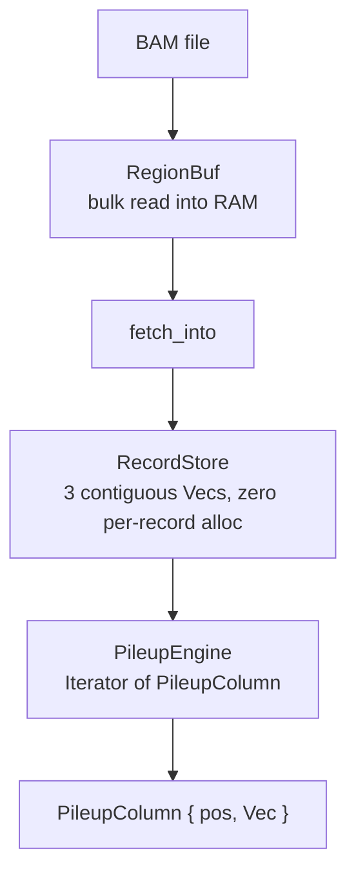

# seqair

Pure-Rust indexed BAM/CRAM/FASTA reader and pileup engine.

## Why a custom implementation

Cause we wanted to try it!
This allows us to tweak the pieces that we want and to experiment with different approaches.

Right now, we have:

- Zero per-record allocation: `RecordStore` packs all variable-length data into contiguous byte slabs (names + data). No `Box`, no `Rc`.
- Cluster-optimized I/O: `RegionBuf` bulk-reads all compressed bytes for a region in one operation, then decompresses from memory. Important for high-latency NFS/Lustre on HPC clusters.
- Custom pileup engine: tailored access patterns with overlapping-pair dedup, per-position max-depth, and read filtering.
- SIMD optimizations for x86_64 (SSSE3, AVX2) and aarch64
- Only native dependency is `libdeflate`.

## Architecture



## Specs

Requirements live in `docs/spec/*.md` using [Tracey](https://tracey.bearcove.eu/) `r[rule.id]` syntax. Implementations are annotated `// r[impl rule.id]`, tests `// r[verify rule.id]`.

## Testing

```sh
cargo test
```

Comparison tests in `tests/` validate against `rust-htslib`. Property tests use `proptest`.
